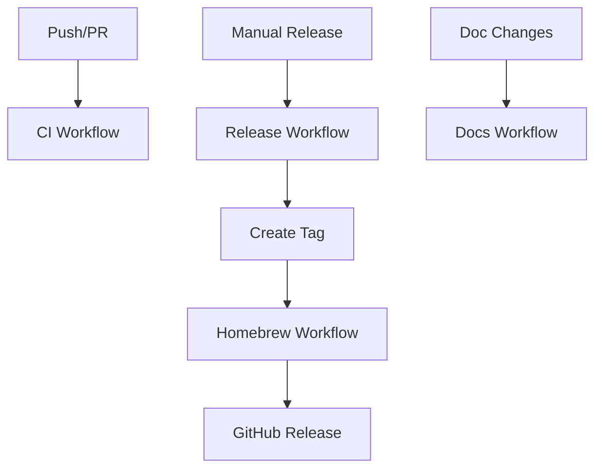

# 🚀 GitHub Actions Workflows

This directory contains the CI/CD automation workflows for the Apple Deploy Platform.

## 📋 **Workflow Overview**

### 🧪 **CI - Core Testing** (`ci.yml`)
**Triggers**: Push to main/develop, PRs to main, manual dispatch
**Purpose**: Comprehensive testing and validation

**Jobs**:
- **Ruby & FastLane Tests**: Test Ruby scripts and FastLane configuration across Ruby 2.7, 3.0, 3.1
- **Shell Script Tests**: Validate bash scripts with ShellCheck and syntax checking  
- **Security & Quality**: TruffleHog secret scanning, hardcoded credential detection
- **Integration Tests**: Test apple-deploy init simulation and status commands
- **macOS Compatibility**: Test on macOS 12, 13, and latest versions

---

### 🍺 **Homebrew Management** (`homebrew.yml`)
**Triggers**: Git tags (v*), manual dispatch with version input
**Purpose**: Automate Homebrew formula deployment

**Jobs**:
- **Formula Validation**: Validate Homebrew formula syntax and structure
- **Deploy to Tap**: Update `snooky23/homebrew-tools` with new formula version
- **Test Installation**: Verify installation works from Homebrew tap
- **Create GitHub Release**: Generate release with archives and notes

**Key Features**:
- ✅ Automatic SHA256 calculation for formula integrity
- ✅ Version extraction from git tags or manual input
- ✅ Formula validation before deployment
- ✅ Release archive creation with proper exclusions
- ✅ Automated GitHub release generation

---

### 🏷️ **Release Automation** (`release.yml`) 
**Triggers**: Manual dispatch with release type selection
**Purpose**: Orchestrate complete release process

**Jobs**:
- **Create Release Tag**: Version bumping (patch/minor/major) and tag creation
- **Wait for Homebrew**: Coordinate with Homebrew workflow
- **Post-Release Validation**: Verify deployment success and create summaries

**Release Types**:
- **Patch**: 2.10.0 → 2.10.1 (bug fixes)
- **Minor**: 2.10.0 → 2.11.0 (new features)  
- **Major**: 2.10.0 → 3.0.0 (breaking changes)

---

### 📚 **Documentation & Quality** (`docs.yml`)
**Triggers**: Changes to markdown/docs, weekly schedule, manual dispatch
**Purpose**: Maintain documentation quality and consistency

**Jobs**:
- **Documentation Quality**: Markdown link checking and linting
- **Ruby Code Quality**: RuboCop analysis and syntax validation
- **Shell Script Quality**: ShellCheck analysis and permission checking
- **Security Analysis**: Trivy filesystem scanning and secret detection
- **Documentation Consistency**: Version and command consistency validation

---

## 🔄 **Workflow Dependencies**



---

## 🚀 **Usage Examples**

### **Trigger Full Release Process**
1. Go to **Actions** → **Release Automation**
2. Click **Run workflow**
3. Select release type: `patch`, `minor`, or `major`
4. Optionally mark as pre-release
5. Click **Run workflow**

**What happens**:
- ✅ Version bumped in all files
- ✅ Git tag created and pushed
- ✅ Homebrew formula updated automatically
- ✅ GitHub release created with archives
- ✅ Installation validated

### **Manual Homebrew Deployment**
1. Go to **Actions** → **Homebrew Formula Management**  
2. Click **Run workflow**
3. Enter version (e.g., `v2.10.1`)
4. Optionally force deploy
5. Click **Run workflow**

### **Test Changes Before Merge**
- **Automatic**: CI workflow runs on all PRs
- **Manual**: Go to **Actions** → **CI - Core Testing** → **Run workflow**

---

## 🔧 **Secrets Configuration**

The workflows require these repository secrets:

| Secret | Purpose | Required For |
|--------|---------|-------------|
| `GITHUB_TOKEN` | GitHub API access | All workflows (auto-provided) |

**Note**: GitHub automatically provides `GITHUB_TOKEN` with appropriate permissions for most operations.

---

## 📊 **Workflow Status Badges**

Add these to your README.md for workflow status visibility:

```markdown


```

---

## 🐛 **Troubleshooting**

### **Common Issues**

**❌ "Formula validation failed"**
- Check `ios-deploy-platform.rb` syntax
- Verify version format in formula
- Ensure SHA256 matches archive

**❌ "Tag already exists"**  
- Check existing tags: `git tag -l`
- Use force deploy or different version
- Clean up tags if needed: `git tag -d v2.10.x`

**❌ "Homebrew tap update failed"**
- Check `snooky23/homebrew-tools` repository access
- Verify GitHub token permissions
- Check for conflicting PRs in tap repository

### **Manual Recovery**

**Fix failed Homebrew deployment**:
1. Go to `snooky23/homebrew-tools` repository
2. Manually update `apple-deploy.rb` formula
3. Calculate SHA256: `shasum -a 256 your-archive.tar.gz`
4. Update version and SHA256 in formula
5. Commit and push changes

**Rerun specific workflow**:
1. Go to **Actions** tab
2. Find the failed workflow run
3. Click **Re-run jobs** or **Re-run failed jobs**

---

## 🔮 **Future Enhancements**

- **📱 Slack/Discord Notifications**: Release announcements
- **🧪 End-to-End Testing**: Full iOS deployment testing in CI
- **📊 Performance Benchmarking**: Track deployment speed over time
- **🔐 Enhanced Security**: Dependency scanning, SAST analysis
- **📈 Metrics Collection**: Workflow success rates and timing
- **🌍 Multi-Platform Support**: Test on different runner types

---

## 📚 **Related Documentation**

- **Main README**: [../README.md](../README.md) - Project overview and usage
- **Setup Guide**: [../docs/setup.md](../docs/setup.md) - Detailed setup instructions  
- **Architecture**: [../docs/architecture.md](../docs/architecture.md) - Technical implementation
- **Security Guide**: [../docs/security.md](../docs/security.md) - Security best practices

---

*🤖 Generated with [Claude Code](https://claude.ai/code)*