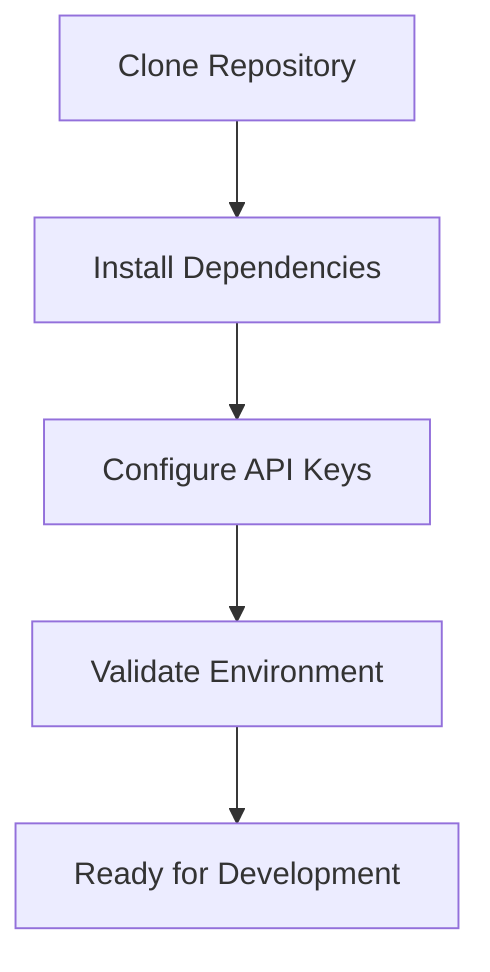
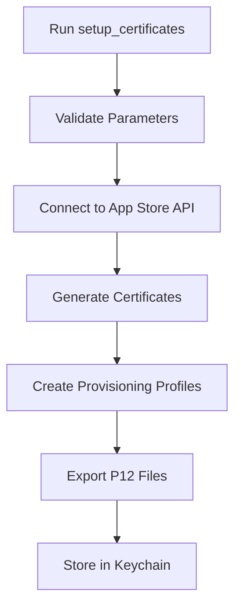
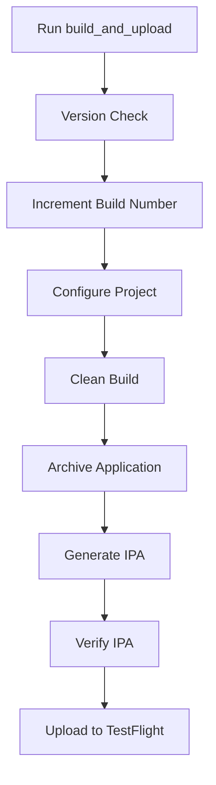

# PLANNING.md - iOS Publishing Automation Platform

## 🎉 **VISION ACHIEVED - PRODUCTION READY PLATFORM v1.5** ✅

**Transform iOS app deployment from a complex, error-prone manual process into a simple, automated one-command operation with enhanced security isolation.**

✅ **COMPLETE**: Created a comprehensive, automated iOS publishing platform with temporary keychain security system that eliminates manual configuration errors, reduces deployment time from hours to minutes, and provides a consistent, repeatable workflow for iOS developers and teams of all sizes with zero system interference.

### Strategic Vision Goals ✅ **ALL ACHIEVED + SECURITY ENHANCEMENTS**
- ✅ **Democratize iOS Publishing**: Professional-grade iOS deployment accessible with simple one-command operation
- ✅ **Eliminate Deployment Friction**: Complete automation from certificate setup through TestFlight upload
- ✅ **Enable Rapid Iteration**: 5-10 minute deployment cycles with retry logic and error recovery
- ✅ **Scale with Teams**: Configuration files, CLI interface, and enterprise-grade security
- ✅ **Security Isolation**: Temporary keychain system with zero system interference
- ✅ **Automatic Cleanup**: Complete certificate environment cleanup after each build

## Architecture Overview

### System Architecture

```
┌─────────────────────────────────────────────────────────────────┐
│                    iOS Publishing Automation Platform           │
├─────────────────────────────────────────────────────────────────┤
│                         User Interface Layer                   │
├─────────────────────┬───────────────────┬───────────────────────┤
│   Command Line      │   Configuration   │    Progress &         │
│   Interface (CLI)   │   Validation      │    Error Reporting    │
├─────────────────────┴───────────────────┴───────────────────────┤
│                       Core Automation Layer                    │
├─────────────────────┬───────────────────┬───────────────────────┤
│   Certificate       │   Build Pipeline  │   Version Management  │
│   Management        │   Automation      │   & Validation        │
├─────────────────────┼───────────────────┼───────────────────────┤
│   Provisioning     │   IPA Generation  │   TestFlight Upload   │
│   Profile Mgmt      │   & Verification  │   & Metadata Mgmt     │
├─────────────────────┴───────────────────┴───────────────────────┤
│                      Integration Layer                         │
├─────────────────────┬───────────────────┬───────────────────────┤
│   App Store Connect │   Xcode Build     │   Temporary Keychain │
│   API Integration   │   System          │   Security System    │
├─────────────────────┴───────────────────┴───────────────────────┤
│                       Platform Layer                           │
├─────────────────────┬───────────────────┬───────────────────────┤
│   macOS             │   Ruby Runtime    │   File System        │
│   Environment       │   & Fastlane      │   & Security          │
└─────────────────────┴───────────────────┴───────────────────────┘
```

### Component Architecture

#### 1. **Core Automation Engine** (Primary Layer)
- **Script Deployment Service**: Dynamic fastlane script distribution system
  - Copy `scripts/fastlane/` directory to `app/fastlane/` before execution
  - Copy `scripts/fastlane_config.rb` to `app/` directory when needed
  - Working directory management for proper Xcode project context
  - Optional script cleanup after execution completion
- **Temporary Keychain Security Service**: Isolated certificate management system
  - Create temporary keychain: `fastlane-generic-apple-build.keychain`
  - Use P12 password as keychain password for consistency
  - Complete isolation from system keychain
  - Automatic cleanup after build completion
- **Smart Certificate Detection Service**: Multi-tier certificate discovery system
  - Temporary keychain certificate import and validation
  - File-based certificate (.cer + .p12) detection in certificates/ directory
  - Certificate expiration and validity checking in isolated environment
- **Certificate Lifecycle Management Service**: Intelligent certificate creation and cleanup
  - Apple Developer Portal certificate limit monitoring (2 Dev, 3 Dist per account)
  - API-created certificate tracking and removal when limits reached
  - Oldest certificate cleanup as fallback strategy
  - Automated P12 export for certificate persistence and team sharing
- **Provisioning Profile Service**: Development and distribution profile management with auto-creation
- **Build Pipeline Service**: Clean, compile, archive, and package iOS applications
- **Version Management Service**: Intelligent version conflict resolution with App Store/TestFlight
- **Upload Service**: Secure TestFlight upload with metadata and changelog management

#### 2. **Configuration & Validation Layer**
- **Parameter Validation System**: Comprehensive validation of all required inputs
- **File System Manager**: Secure handling of certificates, profiles, and temporary files
- **Security Manager**: API key handling, temporary keychain integration, and sensitive data protection
- **Error Recovery System**: Intelligent error handling with retry mechanisms and rollback

#### 3. **Integration Interfaces**
- **Apple Services Integration**: App Store Connect API, Certificate Portal, TestFlight
- **Development Tools Integration**: Xcode, xcodebuild, security keychain, PlistBuddy
- **CI/CD Integration Points**: Extensible for GitHub Actions, Jenkins, and other platforms

#### 4. **Data Management**
```
Project Data Structure:
├── Configuration Data
│   ├── App Parameters (Bundle ID, Team ID, API Keys)
│   ├── Build Configuration (Scheme, Configuration, Signing)
│   └── Deployment Settings (TestFlight, App Store)
├── Security Assets (PRIMARY FOCUS)
│   ├── Certificates (Development, Distribution)
│   │   ├── .cer files (certificate public keys)
│   │   ├── .p12 files (certificate + private key)
│   │   └── Certificate metadata (creation date, source: API/manual)
│   ├── Provisioning Profiles (Development, Ad Hoc, App Store)
│   ├── API Keys (App Store Connect P8 files)
│   └── Keychain Integration (macOS security framework)
├── Certificate Management Cache
│   ├── Apple Developer Portal certificate inventory
│   ├── Certificate limit tracking (2 Dev, 3 Dist max)
│   ├── API-created certificate registry
│   └── Certificate cleanup logs
├── Build Artifacts
│   ├── Archives (.xcarchive)
│   ├── IPAs (signed applications)
│   └── Debug Symbols (.dSYM)
└── Metadata & Logs
    ├── Certificate Detection History
    ├── Certificate Creation/Cleanup Logs
    ├── Version History
    ├── Build Logs
    └── Upload Status
```

## Technology Stack

### Core Technologies

#### **Runtime Environment**
- **Ruby**: >= 2.7.0
  - Primary runtime for fastlane execution
  - Gem dependency management
  - Cross-platform compatibility

#### **Automation Framework**
- **Fastlane**: >= 2.200.0
  - Primary automation framework
  - iOS-specific deployment capabilities
  - Extensive plugin ecosystem

#### **Required Fastlane Plugins**
```ruby
# Core iOS functionality
gem 'fastlane-plugin-spaceship'     # App Store Connect API
gem 'fastlane-plugin-cert'          # Certificate management
gem 'fastlane-plugin-sigh'          # Provisioning profiles
gem 'fastlane-plugin-gym'           # Building and packaging

# Advanced features
gem 'fastlane-plugin-pilot'         # TestFlight uploads
gem 'fastlane-plugin-deliver'       # App Store uploads
gem 'fastlane-plugin-match'         # Team certificate sync (future)
gem 'fastlane-plugin-scan'          # Testing integration (future)
```

#### **Build System**
- **Xcode**: >= 12.0 (recommended >= 14.0)
  - Native iOS build system
  - Code signing and provisioning
  - Archive and export capabilities

#### **Platform Requirements**
- **macOS**: >= 11.0 (Big Sur) - required for iOS development
- **iOS SDK**: Latest available through Xcode
- **Command Line Tools**: Xcode Command Line Tools installed

### External Service Dependencies

#### **Apple Services**
- **App Store Connect API**
  - Certificate and provisioning profile management
  - App metadata and version management
  - TestFlight upload and distribution
  - Version and build number validation

- **Apple Developer Portal**
  - Certificate generation and validation
  - Bundle ID registration and management
  - Team and capability management

#### **Authentication Requirements**
- **App Store Connect API Key** (P8 file)
  - Key ID (8-character identifier)
  - Issuer ID (UUID format)
  - Private key file (.p8 format)
  - Appropriate permissions for app management

### Development Tools Integration

#### **File System Tools**
```bash
# macOS native tools
security          # Keychain management
plutil            # Property list manipulation
codesign          # Code signing verification
spctl             # Security policy verification

# Archive and compression
unzip             # IPA extraction for verification
zip               # Archive creation
tar               # Backup and compression
```

#### **Network and API Tools**
- **curl**: HTTP requests and API communication
- **openssl**: Certificate validation and cryptographic operations
- **Ruby HTTP libraries**: Net::HTTP, Faraday for API integration

## Required Tools List

### Essential Development Environment

#### **1. macOS System Requirements**
- **Operating System**: macOS 11.0+ (Big Sur or later)
- **Hardware**: Intel or Apple Silicon Mac
- **Storage**: Minimum 50GB free space for Xcode and builds
- **Memory**: 8GB RAM minimum (16GB recommended)

#### **2. Core Development Tools**
```bash
# Install Xcode from App Store
xcode-select --install              # Command Line Tools

# Install Homebrew (package manager)
/bin/bash -c "$(curl -fsSL https://raw.githubusercontent.com/Homebrew/install/HEAD/install.sh)"

# Install Ruby via rbenv (version management)
brew install rbenv ruby-build
rbenv install 2.7.6
rbenv global 2.7.6

# Install Fastlane
gem install fastlane
```

#### **3. Required Certificates and Accounts**
- **Apple Developer Account** ($99/year)
  - Individual or Organization account
  - App Store Connect access
  - Certificate generation capabilities

- **App Store Connect API Key**
  - Account Holder or Admin role required
  - Generate P8 key file
  - Note Key ID and Issuer ID

#### **4. Project Setup Tools**
```bash
# Git for version control
brew install git

# Text editor/IDE (choose one)
brew install --cask visual-studio-code    # VS Code
brew install --cask xcode                 # Xcode (also from App Store)

# Optional: Terminal enhancements
brew install zsh zsh-completions
brew install tree                         # Directory visualization
```

### Optional but Recommended Tools

#### **Development Productivity**
```bash
# Process monitoring
brew install htop

# JSON processing (for API debugging)
brew install jq

# Network debugging
brew install wget curl

# Archive tools
brew install unzip zip
```

#### **CI/CD Integration Tools** (Future phases)
- **GitHub Actions**: YAML workflow configuration
- **Jenkins**: Pipeline integration
- **Docker**: Containerized build environments
- **Slack/Teams**: Notification integrations

## Development Workflow Architecture

### **Local Development Workflow**

#### **Phase 1: Project Setup**


#### **Phase 2: Certificate Management**


#### **Phase 3: Build and Deploy**


### **Team Collaboration Architecture**

#### **Shared Resources Management**
- **Certificate Sharing**: Secure distribution of P12 files
- **Configuration Standardization**: Shared parameter templates
- **Version Coordination**: Centralized version management
- **Access Control**: Team-based API key management

#### **Scalability Considerations**
- **Multi-App Support**: Handle multiple iOS projects
- **Environment Management**: Development, Staging, Production
- **Parallel Builds**: Concurrent processing capabilities
- **Resource Optimization**: Efficient use of build resources

## Deployment Architecture

### **Supported Deployment Models**

#### **1. Local Development Machine**
- Single developer workflow
- Direct certificate management
- Local keychain storage
- Manual trigger deployment

#### **2. Shared Development Environment**
- Team-based certificate sharing
- Centralized configuration management
- Coordinated version control
- Manual or scheduled deployments

#### **3. CI/CD Pipeline Integration** (Future)
- Automated trigger on code changes
- Secure credential management
- Parallel build processing
- Automated testing integration

### **Security Architecture**

#### **Data Protection Strategy**
```
Security Layers:
├── Network Security
│   ├── TLS/SSL for all API communications
│   ├── Certificate pinning for Apple services
│   └── Secure token management
├── Local Security
│   ├── Keychain integration for certificates
│   ├── File system permissions
│   └── Temporary file cleanup
├── Access Control
│   ├── API key scope limitation
│   ├── Team-based access controls
│   └── Audit logging
└── Data Protection
    ├── Sensitive file gitignore
    ├── Encrypted at-rest storage
    └── Secure deletion of temporary files
```

#### **Threat Mitigation**
- **Certificate Exposure**: Git ignore patterns, secure storage
- **API Key Compromise**: Scope limitation, rotation policies
- **Man-in-the-Middle**: Certificate pinning, TLS verification
- **Local File Access**: File permissions, keychain integration

## Success Metrics and Monitoring

### **Performance Metrics**
- **Deployment Time**: Target <30 minutes (vs 2-4 hours manual)
- **Success Rate**: >95% automated deployments
- **Error Recovery**: <5% manual intervention required
- **Setup Time**: <10 minutes first-time configuration

### **Quality Metrics**
- **Configuration Errors**: <1% due to validation
- **Certificate Issues**: <2% failure rate
- **Build Consistency**: 100% reproducible builds
- **Version Conflicts**: 0% due to intelligent management

### **User Experience Metrics**
- **Command Complexity**: Maximum 2 commands per workflow
- **Learning Curve**: <1 hour to productivity
- **Documentation Clarity**: <5 support requests per 100 users
- **Error Message Quality**: Self-resolving error guidance

This planning document provides the comprehensive foundation for building a robust, scalable, and user-friendly iOS publishing automation platform that serves developers from individual contributors to enterprise teams.